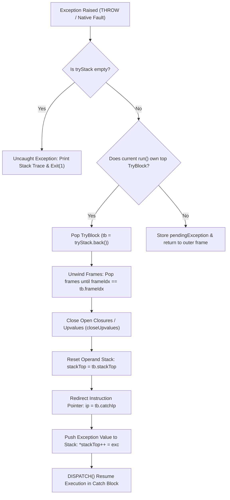

# 🛡️ Exception Handling Engine & Architecture

This document details the architectural design, compilation mechanics, runtime data structures, and frame-unwinding pipeline for exception handling in the **EZ Programming Language Interpreter**.

---

## 1. 🏗️ High-Level Architectural Model

Exception handling in EZ uses a **Virtual Machine Frame-Unwinding Model** rather than native C++ `try`/`catch` blocks.

```
┌────────────────────────────────────────────────────────┐
│                   EZ Source Code                       │
│    try { ... } catch (e) { ... } finally { ... }       │
└──────────────────────────┬─────────────────────────────┘
                           │ Compilation
                           ▼
┌────────────────────────────────────────────────────────┐
│                   Bytecode Stream                      │
│   TRY_START ➔ Body ➔ TRY_END ➔ FINALLY_START/END       │
└──────────────────────────┬─────────────────────────────┘
                           │ VM Execution & Dispatch
                           ▼
┌────────────────────────────────────────────────────────┐
│                  Bytecode Virtual Machine              │
│   • tryStack (active TryBlock records)                 │
│   • frames (call stack unwinding + upvalue closing)    │
│   • operand stack top restoration                      │
│   • computed goto re-routing                           │
└────────────────────────────────────────────────────────┘
```

---

## 2. 🧩 Bytecode Instruction Set

| Opcode | Operands | Description |
| :--- | :--- | :--- |
| **`TRY_START`** | `offset: uint32` | Pushes a `TryBlock` record onto `tryStack` pointing to the catch handler at `ip + offset`. |
| **`TRY_END`** | *none* | Pops the topmost `TryBlock` from `tryStack` when the `try` body completes without errors. |
| **`FINALLY_START`** | *none* | Marks entry into a `finally` block. |
| **`FINALLY_END`** | *none* | Exits a `finally` block; if `pendingException` is active, resumes exception propagation. |
| **`THROW`** | *none* | Pops top of evaluation stack as exception object, builds stack trace, and triggers unwinding. |

---

## 3. 🧠 Virtual Machine Data Structures

### `TryBlock` Record
Defined in [`BytecodeVM.h`](file:///c:/Users/HP/OneDrive/Desktop/EZ/EZ-language/src/vm/BytecodeVM.h#L133-L138):
```cpp
struct TryBlock {
    size_t          frameIdx;   // Call frame index that owns this try block
    const uint8_t*  catchIp;    // Instruction pointer to catch block entry
    const uint8_t*  finallyIp;  // Instruction pointer to finally block entry (if present)
    Value*          stackTop;   // Exact operand stack top before entering try block
};
```

### VM State Fields
```cpp
std::vector<TryBlock> tryStack;          // Active stack of try blocks
Value                 pendingException;  // Currently active in-flight exception
```

---

## 4. ⚡ Compilation Pipeline

When the compiler encounters a `try-catch-finally` statement ([`BytecodeCompilerStmt.cpp`](file:///c:/Users/HP/OneDrive/Desktop/EZ/EZ-language/src/compiler/BytecodeCompilerStmt.cpp#L1660-L1750)):

```ez
try {
    doWork()
} catch err {
    handleError(err)
}
```

It emits the following sequential bytecode layout:

```text
[Offset]  [Instruction]
   0000   TRY_START  -> jump to 0020 (Catch Handler)
   0005   ... (Bytecode for doWork()) ...
   0015   TRY_END
   0016   JUMP       -> jump to 0035 (After Catch Block)
   0020   [Catch Entry Point]
   0021   STORE_LOCAL (err)
   0023   POP
   0024   ... (Bytecode for handleError(err)) ...
   0035   [Continuation of Program]
```

---

## 5. 🔄 Runtime Execution & Unwinding Flow

When an exception occurs (via `throw expr` or a native C++ runtime fault via `runtimeError` / `throwException`):



---

## 6. 🔒 Event Loop & FFI Safety (Why Not C++ `throw`?)

EZ is built on a multi-threaded architecture with **libuv async I/O** and **Win32 native C callbacks**:
1. **No C++ Exception Leaks Across C ABIs**:
   Throwing C++ exceptions across `libuv` C event loop callbacks or native Win32 FFI function pointers (`WndProc`) causes instant process crashes.
2. **Safe Fault Routing (`handle_vm_fault`)**:
   When a native helper or VM instruction faults, it sets `pendingException` and routes via `goto handle_vm_fault` within the local `run()` loop.
